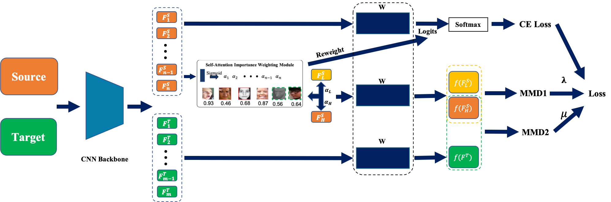

# 文字处理

## 标题

“#”+空格，代表一级标题；依次类推，标题前面加六个“#”代表六级标题；一共有六级标题

## 强调/加粗

在要强调内容前后分别加两个“*”号

command+B

**强调**

## 斜体

前后分别加上一个“*”号：

command+I

*斜体*

## 删除线

内容前后分别加上两个“~”号：

~~删除线~~

## 分割线 

输入三个或三个以上“-”（“*”），再按回车键，即出现一条分割线

---

## 生成目录

[TOC]+回车

## 其他文字处理快捷键

<u>下划线</u>：command+U

查找：command+F

减少/增加缩进：command+[ / command+]

# 列表处理

## 有序列表

输入数字“1”+“.”+空格 

option+command+o

1. 自动开始
2. 有序列表

## 无序列表

输入“+”或“-”或“*”+空格

option+command+u

- 自动开始
- 无序列表

## 任务列表

option+command+x

- [x] 任务
- [ ] 列表

## table

option+command+T

在弹出的对话框中选择行列数，自动生成列表

| 在弹出的对话框中选择行列数 |
| -------------------------- |
| 自动生成列表               |

或用'|'分隔然后回车创建表格,使用command+回车新添一行

| 或用"\|" | 分隔 | 然后 |
| -------- | ---- | ---- |
| 回车     | 创建 | 表格 |
|          |      |      |

# 专业进阶处理

## 插入

插入本地图片：直接把图片拖入即可；  

如： 浏览通过command+点击

插入网络图片：!+[]+()

[]中为图片名称

()中为图片链接

如：

## 链接

插入链接：[]+()

[]中为链接提示

()中为链接地址

如：[百度](www.baidu.com)

## 数学公式

数学公式：“$$”+回车
$$
a^2+b^2=c^2
$$

## 代码

代码块：“～～～”+回车

~~~python
import numpy as np
import cv2
~~~

行内代码：代码的两端各加一个“`”号

如：`行内代码`

